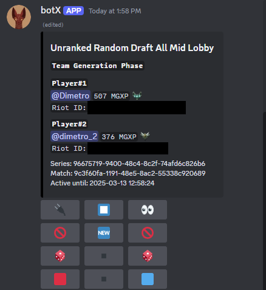

# **BotX**

# Table of contents
1. [Introduction](#introduction)
2. [Installation Guide](#installation-guide)
    - [Prerequisites](#prerequisites)
    - [Clone the Repository](#1-clone-the-repository)
    - [Configure Environment Variables](#2-configure-environment-variables)
    - [Build and Run the Bot](#3-build-and-run-the-bot)
    - [Access the Bot on Discord](#4-access-the-bot-in-discord)
    - [Stop the Bot](#5-stop-the-bot)
    - [Updating the Bot](#6-updating-the-bot)
3. [Features](#features)
    - [Admin Features](#admin-features)
    - [Music Streaming](#music-streaming)
    - [League of Legends Integration](#league-of-legends-integration)
4. [Commands](#commands)
    - [Admin Commands](#admin-commands)
    - [Music Commands](#music-commands)
    - [League of Legends Commands](#league-of-legends-commands)
5. [Interaction Buttons](#interaction-buttons)
    - [Music Player Buttons](#music-player-buttons)
    - [Playlist Manager Buttons](#playlist-manager-buttons)
    - [Playlist Guild Manager Buttons](#playlist-guild-manager-buttons)
    - [Ad Display Buttons](#ad-display-buttons)
    - [League of Legends Leaderboard Buttons](#league-of-legends-leaderboard-buttons)
    - [League of Legends Lobby Buttons](#league-of-legends-lobby-buttons)

# Introduction

### Welcome to BotX!

This is a highly customizable Discord bot built with Python and Docker, designed for high-quality music streaming and gaming features. It includes built-in playlist functionality and integrates seamlessly with platforms like YouTube and Spotify. Additionally, it supports League of Legends integration, providing a variety of tools for users to connect and manage game lobbies, track leaderboards, having a built-in elo system for competing with your friends. 

This bot is an implementation integrated with the [BotCore](https://github.com/e-honceriu/BotCore) backend, which is also a project developed by me. BotCore serves as the core infrastructure fot the bot, enabling seamless communication and funtionality between the bot and its various features.

# Installation Guide

Follow the steps below to setup and run the project using Docker.

## Prerequisites

- **Docker**: [Download Docker](https://www.docker.com/products/docker-desktop)
- **Docker Compose**: Docker Compose is usually included with Docker Desktop, but if not, you can install it from [here](https://docs.docker.com/compose/install/).

## 1. Clone the Repository

- Start by cloning the repository to your local machine:

    ```bash
    git clone https://github.com/e-honceriu/BotX
    cd BotX
    ```

## 2. Configure Environment Variables

- Modify or create the `.env` file located in the root directory of the project.

- The `.env` file should include the following variables:

    ```bash
    BACKEND_URL=
    DATA_PATH=
    BOT_API_KEY=
    DISCORD_TOKEN=
    ```

- **`BACKEND_URL`**: 
    - The URL of the backend server that the bot communicates with (i.e., the URL where the [BotCore](https://github.com/e-honceriu/BotCore) runs).
- **`DATA_PATH`**: 
    - This is where your bot stores files it needs to operate, such as logs, configuration files, ad mp3 files. 
    - You should specify the **absolute path** where you want these files to be saved.
    - **Example**: `/home/user/bot/data`
- **`BOT_API_KEY`**:
    - The API key required to interact with the backend server, see [BotCore](https://github.com/e-honceriu/BotCore) in order to generate one.
- **`DISCORD_TOKEN`**:
    - This token is used to authenticate your bot with the Discord API. 
    - You can get your token by creating a bot in the [Discord Developer Portal](https://discord.com/developers/applications). 
    - After creating your bot, navigate to the "Bot" section of the application settings and copy the token.

## 3. Build and Run the Bot

- Note that this might take a while if it is the first time you are running it.

### **Linux/macOS**

- In the root directory of the project, run the following commands to load the environment variables, build the Docker image (if not already built), and start the bot. 
- `env.sh` reads the `.env` file and sets the environment variables for the session.

    ```bash
    chmod +x env.sh
    source env.sh
    docker compose up --build
    ```

### **Windows**

- In the root directory of the project, run the following commands to load the environment variables using the env.bat script, build the Docker image (if not already built), and start the bot.
- `env.bat` reads the `.env` file and sets the environment variables for the session.

    ```bash
    call env.bat
    docker compose up --build
    ```

## 4. Access the Bot in Discord

- Once the bot is running:
    - Invite the Bot to Your Server:
        - If the bot is not already in your server, you need to invite it.
        - Go to the OAuth2 tab in your bot's application page in the Discord Developer Portal.
        - Under OAuth2 URL Generator, select the required permissions and generate an invite link.
        - Use the generated link to invite the bot to your server.
    - Use bot's commands
        - Use the [List of Commands](#commands) provided in the documentation.

## 5. Stop the Bot

- You can stop all containers, including the bot, by running in root directory of the project:

    ```bash
    docker compose down
    ```

## 6. Updating the Bot

To update the bot with the latest changes from the repository:

- 1. Pull the latest changes from the repository

    ```bash
    git pull origin main
    ```

- 2. Rebuild the Docker images to apply the updates:

    ```bash
    docker compose up --build
    ```

# Features

### Admin Features

The bot provides several administrative features that help manage server activities and perform cleanups.

**Key Features**
1. **Purge Messages**:
    - Deletes messages based on custom criteria such as user, channel, user type.
2. **Retrieve Server Log**:
    - Get the bot's logs for the server for troubleshooting and review.

### Music Streaming

The bot allows users to play music directly in voice channels. It supports seamless streaming from popular platforms like YouTube and Spotify, providing high-quality audio.

**Key Features**:
1. **Queue Management**: 
   - Add, remove, shuffle, or navigate through the queue.
2. **Volume Control**: 
   - Adjust the volume to suit your preferences.
3. **Music Player Control**: 
   - Loop a single track or the entire queue.
   - Stop, pause, or resume the music player.
   - Toggle the display of the songs in the queue and navigate through them.
   - Restart the player.
4. **Engagement**: 
   - Like or dislike the currently playing song.
   - Streams are recorded for later reference.
5. **Ads**:
    - Play ads between tracks, while downloading the audio files.
    - Manage ads, including categorizing them into:
     - **Opening**: Ads played at the start of the ad break.
     - **Content**: Ads played during the ad break.
     - **Closing**: Ads played before returning to the song.
6. **Customization**:
    - Enable/Disable ads
    - Change the volume level.
    - Customize the appearance of the buttons themselves.
    - Change the color scheme of the custom buttons and music player.

### League of Legends Integration

The bot integrates with League of Legends, allowing users to monitor leaderboards, manage game lobbies, all based on the Elo system directly through Discord.

**Key Features**
1. **Lobby Management**:
    - Supports multiple game types (e.g., All Mid (AM), Summoner's Rift (SR)).
    - Supports multiple drafting types (e.g., Random Draft (RD), Random Fearless Draft(RFD)).
    - Supports combinations of game types and drafting types with different ranking systems (e.g., RDAM, RFDAM, RDSR, RFDSR, SR).
    - Create ranked/unranked lobbies for all the ranking systems.
    - Connect or disconnect players to/from the lobby.
    - Start matches, automatically creating teams based on Elo ratings for balanced gameplay.
    - Allow teams to ban champions to strategize and prevent certain picks for random draft game types.
    - Generate dynamic champion pools for random draft game types.
    - Live game data tracking is supported, but the application that retrieves the data from the game and sends it to the backend is still under development.
    - Set the winner at the end of the match.
    - Stop the lobby.
2. **Leaderboards**:
    - Displays leaderboards for each ranking system, with an additional Overall leaderboard that combines all of them.
    - Leaderboards refresh automatically every hour.
    - Allows users to navigate through the leaderboards and refresh them manually.
3. **Customization**:
    - Customize the appearance of the lobby and leaderboard buttons.
    - Change the color scheme of the lobbies, leaderboards, and custom buttons.
    - Customize the icons and colors of the teams, choosing them randomly.
    - Set the channels where the leaderboards will be displayed.

# Commands

### Admin Commands

#### 1. **purge_bot_msg**
- **Description**: Deletes bot messages from the specified channel, or from all channels if no channel is provided.
- **Usage**:
    ```
    /purge_bot_msg [channel: TextChannel]
    ```
- **Parameters**:
    - `channel` (Optional): The channel from which to delete bot messages. If no channel is specified, messages from all channels will be purged.
- **Example**: 
    - `/purge_bot_msg` → Purges bot messages from all channels.
    - `/purge_bot_msg #general` → Purges bot messages from the `#general` channel.
- **Permissions**: This command requires admin privileges to execute.

---

#### 2. **purge_msg**
- **Description**: Deletes all messages from a specified channel or all channels. Optionally, it can filter by a user to delete only their messages.
- **Usage**:
     ```
     /purge_msg [user: Member] [channel: TextChannel]
     ```
- **Parameters**:
     - `user` (Optional): A specific user whose messages will be deleted. If not provided, all messages will be deleted.
     - `channel` (Optional): The channel from which to delete messages. If no channel is provided, all channels will be purged.
- **Example**:
     - `/purge_msg` → Purges all messages from all channels.
     - `/purge_msg @User123 #general` → Purges messages from `@User123` in the `#general` channel.
- **Permissions**: This command requires admin privileges to execute.

---

#### 3. **get_logs**
- **Description**: Retrieves and sends the bot logs for the server.
- **Usage**:
     ```
     /get_logs
     ```
- **Parameters**:
    - None.
- **Example**:
    - `/get_logs` → Sends the bot logs to the requesting user.
- **Permissions**: This command requires admin privileges to execute.

---

### Music Commands

- The bot allows users to control music playback in voice channels directly. 
- You can use various commands to interact with the music player and manage the queue.
- Below is a list of available music commands and how to use them.

#### 1. **play**
- **Description**: Plays a song based on the provided URL or title.
- **Usage**:
     ```
     /play [song_name or URL] [platform]
     ```
- **Parameters**:
     - `song_name or URL`: The title or URL of the song you want to play.
     - `platform`: (Optional) Specify the platform (e.g., YouTube, Spotify).
- **Example**:
     - `/play Not Like Us` → Plays the song "Not Like Us".
     - `/play https://youtube.com/song_link` → Plays the song from the specified YouTube URL.
- **Permissions**: Any user connected in a voice channel can use this command.

---

#### 2. **play_next**
- **Description**: Plays a song after the current one.
- **Usage**:
    ```
    /play_next [song_name or URL] [platform]
    ```
- **Parameters**:
    - `song_name or URL`: The title or URL of the song to play next.
    - `platform`: (Optional) Specify the platform (e.g., YouTube, Spotify).
- **Example**:
    - `/play_next Not Like Us → Adds the song "Not Like Us" next in the queue.
- **Permissions**: Any user connected in a voice channel can trigger this command.

---

#### 3. **play_playlist**
- **Description**: Plays a built-in, managed playlist.
- **Usage**:
    ```
    /play_playlist [playlist_title]
    ```
- **Parameters**:
    - `playlist_title`: The title of the playlist to be played.
- **Example**:
    - `/play_playlist 90' Hip Hop` → Adds to the queue all the songs from the playlist "90' Hip Hop".
- **Permissions**: Any user connected in a voice channel can trigger this command.

---

#### 4. **play_playlist_next**
- **Description**: Plays a built-in, managed playlist after the current song.
- **Usage**:
    ```
    /play_playlist [playlist_title]
    ```
- **Parameters**:
    - `playlist_title`: The title of the playlist to be played.
- **Example**:
    - `/play_playlist 90' Hip Hop` → Adds next in the queue all the songs from the playlist "90' Hip Hop".
- **Permissions**: Any user connected in a voice channel can trigger this command.

---

#### 5. **skip**

- **Description**: Skips the current song and moves to the next one in the queue.
- **Usage**:
    ```
    /skip
    ```
- **Example**:
    - `/skip` → Skips the current song.
- **Permissions**: Any user can trigger this command.

---

#### 6. **pause**

- **Description**: Pauses the current song.
- **Usage**:
    ```
    /pause
    ```
- **Example**:
    - `/pause` → Pauses the music player.
- **Permissions**: Any user can trigger this command.

---

#### 7. **resume**
- **Description**: Resumes the paused song.
- **Usage**:
    ```
    /resume
    ```
- **Example**:
    - `/resume` → Resumes the song from where it was paused.
- **Permissions**: Any user can trigger this command.

---

#### 8. **prev**
- **Description**: Plays the previous song in the queue.
- **Usage**:
    ```
    /prev
    ```
- **Example**:
    - `/prev` → Plays the previous song.
- **Permissions**: Any user can trigger this command.

---

#### 9. **like**
- **Description**: Likes the current song.
- **Usage**:
    ```
    /like
    ```
- **Example**:
    - `/like` → Likes the currently playing song.
- **Permissions**: Any user can trigger this command.

---

#### 10. **dislike**
- **Description**: Dislikes the current song.
- **Usage**:
    ```
    /dislike
    ```
- **Example**:
    - `/dislike` → Dislikes the currently playing song.
- **Permissions**: Any user can trigger this command.

---

#### 11. **shuffle**
- **Description**: Shuffles the song queue, without mixing the already played songs with the upcoming ones.
- **Usage**:
    ```
    /shuffle
    ```
- **Example**:
    - `/shuffle` → Shuffles the songs in the queue.
- **Permissions**: Any user can trigger this command.

---

#### 12. **loop**
- **Description**: Toggles looping for the entire song queue.
- **Usage**:
    ```
     loop
    ```
- **Example**:
    - `/loop` → Toggles the looping of the queue.
- **Permissions**: Any user can trigger this command.

---

#### 13. **loop_song**
- **Description**: Toggles looping for the current song.
- **Usage**:
    ```
    /loop_song
    ```
- **Example**:
    - `/loop_song` → Toggles the looping of the current song.
- **Permissions**: Any user can trigger this command.

--- 

#### 14. **stop**
- **Description**: Stops the music player and clears the queue.
- **Usage**:
    ```
    /stop
    ```
- **Example**:
    - `/stop` → Stops the music and clears the queue.
- **Permissions**: Any user can trigger this command.

---

#### 15. **playlist_create**
- **Description**: Creates a new playlist, with the owner as the user who invoked the command.
- **Usage**:
    ```
    /playlist_create [playlist_title]
    ```
- **Parameters**:
    - `playlist_title`: The title of the playlist to create.
- **Example**:
    - `/playlist_create My Playlist` → Creates a new playlist "My Playlist" belonging to the user who invoked the command.
- **Permissions**: Any user can trigger this command.

---

#### 16. **playlist_manage**
- **Description**: Manages an existing playlist.
- **Usage**:
    ```
    /playlist_manage [playlist_title]
    ```
- **Parameters**:
    - `playlist_title`: The title of the playlist to manage.
- **Example**:
    - `/playlist_manage My Playlist` → Starts the playlist manager for "My Playlist".
- **Permissions**: Only the owner of the playlist can trigger this command.

---

#### 17. **playlist_show**
- **Description**: Shows a list of all playlists.
- **Usage**:
    ```
    /playlist_show
    ```
- **Example**:
    - `/playlist_show` → Lists all playlists available.
- **Permissions**: Any user can trigger this command.

---

#### 18. **upload_ad**
- **Description**: Uploads an advertisement sound for the specified type.
- **Usage**:
    ```
    /upload_ad [ad_type] [ad_file]
    ```
- **Parameters**:
    - `ad_type`: The type of ad (e.g., `OPENNING`, `CONTENT`, `CLOSING`).
    - `ad_file`: The MP3 file containing the ad.
- **Example**:
    - `/upload_ad OPENNING ad_file.mp3` → Adds "ad_file.mp3" to the list of openning ads.
- **Permissions**: This command requires admin privileges to execute.

---

#### 19. **show_ads**

- **Description**: Displays ads for the specified type.
- **Usage**:
    ```
    /show_ads [ad_type]
    ```
- **Parameters**:
    - `ad_type`: The type of ad (e.g., `OPENNING`, `CONTENT`, `CLOSING`).
- **Example**:
    - `/show_ads OPENNING` → Lists all the openning ads.
- **Permissions**: Any user can trigger this command.

---

#### 20. **remove_ad**
- **Description**: Removes a specific ad.
- **Usage**:
    ```
    /remove_ad [ad_type] [ad_name]
    ```
- **Parameters**:
    - `ad_type`: The type of ad (e.g., `OPENNING`, `CONTENT`, `CLOSING`).
    - `ad_name`: The name of the ad to remove.
- **Example**:
    - `/remove_ad OPENNING openning_1` → Removes the "openning_1.mp3" from the openning ads list. 
- **Permissions**: This command requires admin privileges to execute.

---

#### 21. **volume**
- **Description**: Sets the volume of the music player.
- **Usage**:
    ```
    /volume [volume_level]
    ```
- **Parameters**:
    - `volume_level`: A value between 0 and 100 to set the volume.
- **Example**:
    - `/volume 75` → Sets the volume of the music player to 75.
- **Permissions**: Any user can trigger this command.

---

#### 22. **enable_ads**
- **Description**: Enables ads in the music player.
- **Usage**:
    ```
    /enable_ads
    ```
- **Example**:
    - `/enable_ads` → Enables the ads.
- **Permissions**: This command requires admin privileges to execute.

---

#### 23. **disable_ads**
- **Description**: Disables ads in the music player.
- **Usage**:
    ```
    /disable_ads
    ```
- **Example**:
    - `/disable_ads` → Disables the ads.
- **Permissions**: This command requires admin privileges to execute.

---

#### 24. **config_ad_display**
- **Description**: Updates the configuration for the ad display in the music player.
- **Usage**:
    ```
    /config_ad_display [config_file]
    ```
- **Parameters**:
    - `config_file`: The ad display config file in JSON format.
- **Example**:
    - `/config_ad_display config.json` → Updates the ad display settings using the provided configuration file.
- **Default Config File**:
    ```json
    {
        "color": [255, 255, 255],
        "buttons": {
            "ad_display_stop": "⏹️",
            "ad_display_prev_page": "⬅️",
            "ad_display_next_page": "➡️"
        },
        "buttonPrimaryColor": null,
        "buttonSecondaryColor": null
    }
    ```
- **Permissions**: This command requires admin privileges to execute.

---

#### 25. **config_music_player**
- **Description**: Updates the configuration for the music player.
- **Usage**:
    ```
    /config_music_player [config_file]
    ```
- **Parameters**:
    - `config_file`: The music player config file in JSON format.
- **Example**:
    - `/config_music_player music_player_config.json` → Updates the music player settings using the provided configuration file.
- **Default Config File**:
    ```json
    {
        "volume": 100,
        "ads": false,
        "color": [0, 0, 0],
        "buttons": {
            "music_player_play_prev": "⏪",
            "music_player_play_next": "⏩",
            "music_player_resume": "▶️",
            "music_player_pause": "⏸️",
            "music_player_loop_q_on": "🔁",
            "music_player_loop_q_off": "🔁",
            "music_player_loop_song_on": "🔂",
            "music_player_loop_song_off": "🔂",
            "music_player_shuffle": "🔀",
            "music_player_like": "👍",
            "music_player_dislike": "👎",
            "music_player_stop": "⏹️",
            "music_player_prev_page": "⬅️",
            "music_player_next_page": "➡️",
            "music_player_display_q": "📜",
            "music_player_volume_up": "🔊",
            "music_player_volume_down": "🔉",
            "music_player_restart": "🔄"
        }
    }
    ```
- **Permissions**: This command requires admin privileges to execute.

---

#### 26. **config_playlist_manager**
- **Description**: Updates the configuration for the playlist manager.
- **Usage**:
    ```
    /config_playlist_manager [config_file]
    ```
- **Parameters**:
    - `config_file`: The playlist manager config file in JSON format.
- **Example**:
    - `/config_playlist_manager playlist_manager_config.json` → Updates the playlist manager settings using the provided configuration file.
- **Default Config File**:
    ```json
    {
        "color":[255, 255, 255],
        "buttons":{
            "playlist_manager_prev_page": "⬅️",
            "playlist_manager_next_page": "➡️",
            "playlist_manager_stop": "⏹️",
            "playlist_manager_delete": "🗑️",
            "playlist_manager_add": "➕",
            "playlist_manager_remove": "➖"
        }
    }
    ```
- **Permissions**: This command requires admin privileges to execute.

---

#### 27. **config_playlist_guild_manager**
- **Description**: Updates the configuration for the playlist guild manager.
- **Usage**:
    ```
    /config_playlist_guild_manager [config_file]
    ```
- **Parameters**:
    - `config_file`: The playlist guild manager config in JSON format.
- **Example**:
    - `/config_playlist_guild_manager playlist_guild_manager_config.json` → Updates the playlist guild manager settings using the provided configuration file.
- **Default Config File**:
    ```json
    {
        "color":[255, 255, 255],
        "buttons":{
            "playlist_guild_manager_prev_page": "⬅️",
            "playlist_guild_manager_next_page": "➡️",
            "playlist_guild_manager_stop": "⏹️",
            "playlist_guild_manager_manage": "🔧",
            "playlist_guild_manager_add": "➕",
            "playlist_guild_manager_remove": "➖"
        }
    }
    ```
- **Permissions**: This command requires admin privileges to execute.

---

### League of Legends Commands

#### 1. **create_lol_lobby**
- **Description**: Generate a League of Legends lobby in the channel you are currently connected to.
- **Usage**:
    ```
    /create_lol_lobby [type] [ranked]
    ```
- **Parameters**:
    - `type`: The game type of the lobby. Options include `RDAM`, `RFDAM`, `RDSR`, `RFDSR`, `SR`.
    - `ranked`: The ranking type of the lobby. Options include `RANKED` and `UNRANKED`.
- **Example**:
    - `/create_lol_lobby RDAM RANKED` → Creates a Ranked RDAM lobby.
- **Permissions**: Any user can trigger this command.

---

#### 2. **set_riot_id**
- **Description**: Connect your RIOT ID for live game data features.
- **Usage**:
    ```
    /set_riot_id [riot_id] [user]
    ```
- **Parameters**:
    - `riot_id`: The RIOT ID to set.
    - `user` (Optional): The user to set the ID to. If not specified, it will set the RIOT ID for the user calling the command.
- **Example**:
    - `/set_riot_id RiotId#TAG` → Sets the RIOT ID for the user who called the command.
    - `/set_riot_id RiotId#TAG @User123` → Sets the RIOT ID for the specified user `@User123`.
- **Permissions**: Admin privileges required to set RIOT ID for other users.

---

##### 3. **lobby_disconnect**
- **Description**: Disconnects from the lobby in the current channel.
- **Usage**:
    ```
    /lobby_disconnect [user]
    ```
- **Parameters**:
    - `user` (optional): The user to disconnect from the lobby.
- **Example**:
    - `/lobby_disconnect` → Disconnects the invoking user.
    - `/lobby_disconnect @user` → Disconnects a specific user.
- **Permissions**: Admin privileges required to disconnect other users.

---

##### 4. **lobby_connect**
- **Description**: Connects to the lobby in the current channel.
- **Usage**:
    ```
    /lobby_connect [user]
    ```
- **Parameters**:
    - `user` (optional): The user to connect from the lobby.
- **Example**:
    - `/lobby_disconnect` → Connects the invoking user.
    - `/lobby_disconnect @user` → Connects a specific user.
- **Permissions**: Admin privileges required to connect other users.

---

#### 5. **set_lol_leaderboard_channel**
- **Description**: Sets the channel in which the League of Legends leaderboards will be sent.
- **Usage**:
    ```
    /set_lol_leaderboard_channel [channel]
    ```
- **Parameters**:
    - `channel`: The channel to set for the leaderboards.
- **Example**:
    - `/set_lol_leaderboard_channel #leaderboards` → Sets the leaderboard channel to #leaderboards.
- **Permissions**: This command requires admin privileges to execute.

---

#### 6. **config_lol_leaderboard**
- **Description**: Uploads the config file for the League of Legends leaderboards.
- **Usage**:
    ```
    /config_lol_leaderboard [file]
    ```
- **Parameters**:
    - `file`: The League of Legends leaderboard config file in JSON format.
- **Example**:
    - `/config_lol_leaderboard leaderboard_config.json` → Uploads the leaderboard configuration file.
- **Default Config File**:
    ```json
    {
        "channelId": null,
        "colors": {
            "RDAM": [
                40,
                255,
                255
            ],
            "RFDAM": [
                137,
                207,
                240
            ],
            "RDSR": [
                175,
                225,
                175
            ],
            "RFDSR": [
                9,
                121,
                105
            ],
            "SR": [
                170,
                255,
                0
            ],
            "OVERALL": [
                238,
                232,
                170
            ]
        },
        "labels": {
            "RDAM": "Random Draft All Mid",
            "RFDAM": "Random Fearless Draft All Mid",
            "RDSR": "Random Draft Summoner's Rift",
            "RFDSR": "Random Fearless Draft Summoner's Rift",
            "SR": "Summoner's Rift",
            "OVERALL": "Overall"
        },
        "buttons": {
            "lol_leaderboard_refresh": "🔄",
            "lol_leaderboard_prev_page": "⬅️",
            "lol_leaderboard_next_page": "➡️"
        }
    }
    ```
- **Permissions**: This command requires admin privileges to execute.

---

#### 34. **config_lol_lobby**
- **Description**: Uploads the config file for the League of Legends lobby.
- **Usage**:
    ```
    /config_lol_lobby [file]
    ```
- **Parameters**:
    - `file`: The League of Legends lobby config file in JSON format.
- **Example**:
    - `/config_lol_lobby lobby_config.json` → Uploads the lobby configuration file.
- **Default Config File**:
    ```json
    {
        "teams": [
            {
                "color": [
                    255, 0, 0
                ],
                "name": "Red",
                "icon": "🟥",
                "buttons": {
                    "lol_lobby_draft": "🎲",
                    "lol_lobby_ban": "🚫"
                }
            },
            {
                "color": [
                    0, 166, 255
                ],
                "name": "Blue",
                "icon": "🟦",
                "buttons": {
                    "lol_lobby_draft": "🎲",
                    "lol_lobby_ban": "🚫"
                }
            }
        ],
        "banLabels": [
            "Champion's name"
        ],
        "lobbyColor": [0, 0, 0],
        "champPoolRerolls": 3,
        "statsFetchIntervalActive": 1,
        "statsFetchIntervalInactive": 5,
        "buttons": {
            "lol_lobby_close": "⏹️",
            "lol_lobby_empty_button": "▪️",
            "lol_lobby_connect_disconnect": "🔌",
            "lol_lobby_champ_pool_hidden_on": "👀",
            "lol_lobby_champ_pool_hidden_off": "👀",
            "lol_lobby_team": "🆕"
        }
    }
    ```
- **Permissions**: This command requires admin privileges to execute.

---

# Interaction Buttons

This section explains the functionality of each button available to interact with the bot during a game session. The bot provides various interactive buttons for interacting with the music player, League of Legends lobbies, and much more.

---

### **Music Player Buttons**


#### **Player Control**

- **`⏪ music_player_play_prev`** → Plays the previous song in the queue.

- **`⏩ music_player_play_next`** → Plays the next song in the queue.

- **`⏸️ music_player_pause`** → Pauses the current song.
    - **State change**: Player moves from **Playing** to **Paused**

    

- **`▶️ music_player_resume`** → Resumes playing the song after it has been paused.
    - **State change**: Player moves from **Paused** to **Playing**

- **`📜 music_player_display_q`** → Displays the current song queue.
    - **State change**: Toggle between showing and hiding the queue.

    

- **`🔁 music_player_loop_q_on`** → Turns off the loop of the entire queue.

- **`🔁 music_player_loop_q_off`** → Turns on the loop of the entire queue.

- **`🔂 music_player_loop_song_on`** → Turns off the loop of the current song.

- **`🔂 music_player_loop_song_off`** → Turns on the loop of current song.

- **`🔀 music_player_shuffle`** → Shuffles the songs in the queue, playing them in random order.

- **`🔄 music_player_restart`** → Restarts the current song from the beginning.

- **`⏹️ music_player_stop`** → This button stops music player.

#### **Navigation**

- **`⬅️ music_player_prev_page`** → Moves to the previous page of the song queue (if there are multiple pages and the queue display in on).

- **`➡️ music_player_next_page`** → Moves to the next page of the song queue (if there are multiple pages and the queue display in on).

#### **Volume Control**

- **`🔊 music_player_volume_up`** → Increases the volume of the music player.

- **`🔉 music_player_volume_down`** → Decreases the volume of the music player.

#### **Engagement**

- **`👍 music_player_like`** → Likes the current song playing.

- **`👎 music_player_dislike`** → Dislikes the current song playing.

---

### **Playlist Manager Buttons**


#### **Navigation**

- **`⬅️ playlist_manager_prev_page`** → Moves to the previous page of the playlist (if there are multiple pages).

- **`➡️ playlist_manager_next_page`** → Moves to the next page of the playlist (if there are multiple pages).

#### **Management**

- **`⏹️ playlist_manager_stop`** → Closes the playlist manager.

- **`🗑️ playlist_manager_delete`** → Deletes the playlist.

- **`➕ playlist_manager_add`** → Add song or external playlist to the managed playlist.

- **`➖ playlist_manager_remove`** → Removes a song from the playlist.

---

### **Playlist Guild Manager Buttons**


#### **Navigation**

- **`⬅️ playlist_guild_manager_prev_page`** → Navigates to the previous page in the playlist manager (if there are multiple pages).

- **`➡️ playlist_guild_manager_next_page`** → Navigates to the next page in the playlist manager (if there are multiple pages).

#### **Management**

- **`⏹️ playlist_guild_manager_stop`** → Closes the playlist guild manager.

- **`🔧 playlist_guild_manager_manage`** → Opens the playlist manager for the specified playlist.

- **`➕ playlist_guild_manager_add`** → Create a new playlist.

- **`➖ playlist_guild_manager_remove`** → Delete a playlist.

---

### **Ad Display Buttons**


#### **Navigation**

- **`⬅️ ad_display_prev_page`** → Navigates to the previous page in the ad display (if there are multiple pages).

- **`➡️ ad_display_next_page`** → Navigates to the next page in the ad display (if there are multiple pages).

#### **Control**

- **`⏹️ ad_display_stop`** → Stops the current ad display session.

---

### League of Legends Leaderboard Buttons


#### **Navigation**

- **`⬅️ lol_leaderboard_prev_page`** Navigates to the previous page in the leaderboard (if there are multiple pages).

- **`⬅️ lol_leaderboard_next_page`** Navigates to the next page in the leaderboard (if there are multiple pages).

#### **Control**

- **`🔄 lol_leaderboard_refresh`** Refreshes the leaderboard to display the most current data.

---

### League of Legends Lobby Buttons




#### **Lobby**

- **`⏹️ lol_lobby_close`** → Closes the current lobby session.

- **`▪️ lol_lobby_empty_button`** → An empty button used for display purposes (no action).

- **`🔌 lol_lobby_connect_disconnect`** → Toggles the connection status: connects if not already in the lobby, or disconnects if currently in the lobby.

- **`🆕 lol_lobby_team`** → Creates a new match, generating new teams.

- **`🟦 blue_team_icon`** → Sets the winner as the blue team.

- **`🟥 red_team_icon`** → Sets the winner as the red team.

- **`👀 lol_lobby_champ_pool_hidden_on`** → Hides the champion pool for the players.

- **`👀 lol_lobby_champ_pool_hidden_off`** → Reveals the champion pool for the players.

    


#### **Team**

- **`🎲 lol_lobby_draft`** → Generates random drafts for the game mode (if applicable) and sends them privately to each team player.

- **`🚫 lol_lobby_ban`** → Bans a champion for the random draft.


# Configuration Options

This section explains the fields in the config files and what each of them does. You can use this as a reference to modify the default settings.

---


